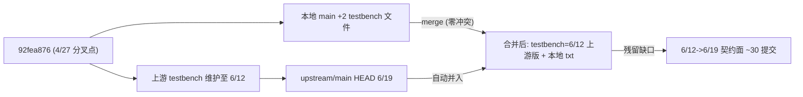

# Testbench 上游同步与更新追踪 (2026-06)

> **文档定位**: 本文是 testbench 框架本轮"对齐上游主程序"工作的**永久化更新说明 +
> 开发计划 + 更新历史追踪**。面向后续接手的开发者 / agent，用于回答三个问题:
> **改了什么 (what)、为什么改 (why)、怎么验证没改炸 (how verified)**。
>
> - 与 `PLAN.md` / `PROGRESS.md` / `AGENT_NOTES.md` 的关系: 那三份是 testbench
>   自身 P00-P26 立项期的长期文档 (会被上游合并覆盖为上游版); **本文是本轮
>   (2026-06) fork 侧同步工作的独立追踪档**, 不随上游合并改写。
> - 维护约定: 本轮工作每完成一个 Phase, 在 [§7 执行记录](#7-执行记录更新历史) 追加一条
>   (日期 + commit + 做了什么 + 验证结果), 让"代码更新历史 + 更新目的"可被追溯。
>
> **基线**: 分叉点 `92fea876` (2026-04-27) → 上游 HEAD `e6e1b433` (2026-06-19)。

---

## 1. 关键背景 (调研结论)

- 本地 `main` 自 2026-04-27 分叉点 (`92fea876`) 起, 仅领先 3 个提交, 且对 testbench 的
  唯一改动是 `tests/testbench/smoke/p00_static_gate_smoke.py` (与上游**字节一致**) 和一个
  本地 `快速开始请读我.txt`。
- `upstream/main` 领先 **794 提交** (主程序改 2493 文件), `git merge-tree` 验证**合并零冲突**。
- 决定性发现: **上游持续维护 testbench** (最后改动 2026-06-12 `3e4b3a3f`), 其导入已全部
  迁移到新 `config.prompts.prompts_*` 子包。因此合并会自动把本地 4 月版 testbench 替换为
  6/12 上游版, 自动修好 `config.prompts` 迁移、memory_runner / external_events /
  prompt_builder 等 19 个文件的漂移。
- 真正残留缺口 = **6/12 → 6/19 约 30 个触及契约面的提交** (TTS 声音注册结构化、
  深话题 / proactive 管线、凝神 focus 模式、迷你游戏 LLM、`de33ca09` 强制每个 LLM 调用带
  budget+timeout 等)。



### 契约面核对结果 (合并后大多稳定)

- `memory/__init__` 六大管理器 (CompressedRecentHistoryManager / FactStore /
  ImportantSettingsManager / PersonaManager / ReflectionEngine / TimeIndexedMemory) 导出齐全。
- `utils.llm_client` (`ChatOpenAI` / `HumanMessage` / `messages_from_dict` /
  `SQLChatMessageHistory`)、`utils.api_config_loader.get_config`、
  `utils.holiday_cache.get_holiday_context_line` 均在。
- `config.prompts.prompts_memory` 仍保留 `persona_correction_prompt` 别名等符号。
- memory 子系统大扩张 (新增 `evidence.py` / `hybrid_recall.py` / `recall.py` /
  `refine.py` / `anti_repeat.py` 等 "evidence-RFC"), 是 Phase 3 新覆盖的重点候选。

---

## 2. 上游 testbench 更新清单 (4/27 分叉点 → 6/19 HEAD)

> 结论: 这段时间 testbench **没有专门的新功能开发**, 9 个提交全部是主程序贡献者在
> 重构主程序时"随手同步" testbench 的导入 / 契约, 本地合并后会自动获得这些改动。

- 总量: **9 提交 / 19 文件 / +410 -151** (对比主程序同期 794 提交、2493 文件, 占比极小,
  无新开阶段如 P27)。
- 更新者: **Hongzhi Wen 6** (主力)、Amadeus 1、yiyiyiyi 1、笨蛋天凌喵 1。

| commit | 日期 | 作者 | 内容 (更新目的) |
|---|---|---|---|
| `022c172e` | 4/27 | 笨蛋天凌喵 | 【只动 test】快速入门说明 (#998) |
| `0339bdbf` | 4/28 | Hongzhi Wen | 扩负面词覆盖 & 摘要/review prompt JSON key ASCII 化 (#1004) |
| `bdee4550` | 4/29 | Hongzhi Wen | 插件 reply bool→delivery 三态拆分 (#1032) |
| `0ef15575` | 4/30 | Hongzhi Wen | yui-origin Live2D 默认模型 + 主动搭话历史元数据 + 反物化称呼修复 (#1041) |
| `87746c9a` | 5/10 | Hongzhi Wen | **[codex] prompt 模块迁入 config 包** (#1268, 即 `config.prompts_*`→`config.prompts.prompts_*`) |
| `c6944fd6` | 5/12 | Hongzhi Wen | 统一负面意图 + 摘要保留用户禁令记录 (#1318) |
| `2fd46978` | 5/18 | Hongzhi Wen | **MemoryRefineEngine + reflection RELATED_CONTEXT + version cap** (#1392, 实质改 `memory_runner.py`) |
| `4d47d26d` | 6/9 | yiyiyiyi | 优化 avatar 工具 prompt + web cursor 层级 (#1711, 实质改 `external_events.py` 与 guide) |
| `3e4b3a3f` | 6/12 | Amadeus | 新增 MiMo assist API TTS 支持 (#1744) |

- 文档 (testbench `docs/` 改了 9 个文件): 绝大多数是 `config.prompts.*` 路径重命名同步;
  唯一实质内容更新是 `external_events_guide.md` (avatar 事件 wire 从 full instruction /
  `reward` 改为 compact instruction / `reward_drop`)。
- 隐患: `memory_runner.py` 实质改了 MemoryRefineEngine, 但 `P25_BLUEPRINT` / `PROGRESS`
  只做了路径同步、**未补该设计说明** —— 文档已开始落后于代码, 印证 Phase 4 必要性。

---

## 3. 实地测试方法与规范 (依据 docs)

> 本轮更新有两条硬性保证: **(一) 先前的上游更新没把框架搞炸; (二) 我们新写的代码也
> 没把框架搞炸。** 二者都不能只靠 smoke 自动化, 必须叠加真实启动 + 真实 UI 手测。

- **证据权威度排序** (`LESSONS_LEARNED.md` §1.1 Intent≠Reality): **用户实测 > AI 推断 >
  文档原则**。smoke 绿 ≠ 框架没炸, 必须以真实运行为准。
- **两层验证叠加**: 自动化层 = `smoke/_run_all.py` (Python smoke) + `smoke/p21_ui_smoke.mjs`
  (jsdom UI smoke) + `smoke/p00_static_gate_smoke.py` 静态门; 实地层 = 启动真服务在浏览器手测。
- **启动命令** (`testbench_USER_MANUAL.md` §1.1, 数据隔离在 `tests/testbench_data/`,
  不污染主程序 `~/.neko/`):

```bash
uv run python tests/testbench/run_testbench.py --port 48920
```

- **实地手测最小走查清单** (覆盖 `USER_MANUAL` 全部主面, 每次回归与新功能都按此清单过):
  - 5 个 Workspace 均能打开无报错: Setup / Chat / Evaluation / Diagnostics / Settings。
  - Settings: 填 API Keys → 配 Models 四组 → [测试连接] 通。
  - Setup: 建会话 + 填 Persona (`character_name` 必填) + Memory 四层 (recent/facts/reflections/persona) 读写。
  - Chat 四模式: Manual / SimUser / Script / Auto 各发一轮; Prompt Preview 三视图正常。
  - 外部事件三类: avatar / agent_callback / proactive 各注入一次, wire 与 memory pair 正常。
  - Memory 5 op: compress / fact-extract / reflect 等的预览 + commit 闭环。
  - Diagnostics: Errors / Logs 有数据、无未捕获异常。
- **独立消费者原则** (skill `docs-code-reality-grep-before-draft`): 文档改动后, 由"没参与写
  该代码的视角"按 `USER_MANUAL` 走一遍, 校验文档=现实; 发现 intent≠reality 即回修。
- **手测证据留痕**: 每轮手测把"操作顺序 + 结果 + 截图/日志要点"记入 [§7 执行记录](#7-执行记录更新历史)。

---

## 4. 设计层面风险排查 (依据 docs 规范, 最高优先级)

> 按 `LESSONS_LEARNED.md` 方法论 + 配套 skills, 对计划做"设计层面"体检, 逐条标出
> **若不在动手前拍定就会埋雷**的决策点。

### D1 · evidence-RFC 记忆子系统的"语义契约 vs 运行时机制"分层 (Phase 3 头号设计风险)
- 实测发现: 上游 `memory_runner.py` **只 import `memory.reflection` / `memory.persona` +
  `config.prompts.prompts_memory` getter, 完全没有引用 `evidence.py` / `hybrid_recall.py` /
  `recall.py` / `refine.py`** —— 即新记忆子系统在 testbench **零覆盖**。
- 这正是 skill `semantic-contract-vs-runtime-mechanism` 警示的场景: **严禁**直接"凭直觉给
  memory_runner 加 evidence 路径", 否则要么误把交付层机制 (embedding worker / outbox 队列 /
  event_log / cursors 游标) 复现进来 (反模式 D), 要么一句"架构不兼容"全盘 OOS (反模式 A)。
- 强制前置动作 (落在 Phase 3.0): 端到端读 `memory/evidence.py` 等模块, 把每个函数/常量填进两列表 ——
  - 语义契约 (pure / importable, testbench **必须**复用): evidence 抽取/打分模板、
    `{evidence, score, rank}` 数据形状、去重/排序策略、recall 的 rerank pure func、
    强力记忆开关的判定逻辑。
  - 运行时机制 (testbench **不复现**, 写明 OOS): `embedding_worker` 后台线程、`outbox`
    异步队列、`event_log` 持久化游标、`cursors`/`archive_shards` 的分片调度、FTS5/向量索引重建。
- 反模式 C 提醒: 直接 `from memory.evidence import _pure_helper` 造成的"耦合"**是想要的** ——
  上游改模板时 testbench 应当 break, 这是测试数据过期的早期信号。
- **2026-06-19 纠偏 (见 §7 Phase 3.0 §0)**: 本条原把"强力记忆开关"当成"hybrid_recall 注入开关"是**错的**。
  `powerful_memory_enabled` gate 的是 evidence-RFC **后台 LLM 管线** (memory_server 常驻 loop), hybrid_recall 是
  独立的 **tool-call 只读检索**。Phase 3 实际可测的纯层是 ①`evidence.py` 数学层 ②hybrid_recall 的 BM25/RRF 融合, 与该开关解耦。

### D2 · 沙盒 = 目录替换, 不 = 配置隔离 (Phase 2 LLM budget/timeout 的设计约束)
- `LESSONS_LEARNED.md` §2.3: testbench 的 LLM 调用必须走**测试端自己的 resolve**
  (`pipeline/chat_runner.create_chat_llm`), 绝不调主程序 `ConfigManager.summary/correction`。
- 处理 `de33ca09` (强制 LLM 调用带 budget+timeout) 时, budget/timeout 要补在 **testbench
  自己的 LLM 包装层**, 不能顺手把主程序 manager 拉进沙盒, 否则破坏沙盒"只替换路径字段"的契约。

### D3 · 每个 LLM 调用点必须 stamp `last_llm_wire` (§7.25 第五层防御·强制侧)
- `LESSONS_LEARNED.md` L25/§7.25 r5 已明文欠账: **5 个 LLM 调用点未走 `wire_tracker`** ——
  `simulated_user` (P0, Auto-Dialog 跑完预览陈旧) / `memory_runner` 4 处 ainvoke +
  `judge_runner` (P1) / `auto_dialog_*` slug 清理 (P2) / `config_router._ping_chat` 明确排除 (P2)。
- 设计铁律: Phase 3 **任何新增 LLM 调用点**, 第一行就要经 `pipeline/wire_tracker.py::record_last_llm_wire`
  (单一写入器 + `KNOWN_SOURCES` 白名单 + `deepcopy`), 并由 `p25_llm_call_site_stamp_coverage_smoke.py`
  扫到 —— 未 stamp 即 FAIL。

### D4 · 预览面板用 ground-truth snapshot, 不重建 (§7.25 5b + skill `preview-panel-domain-partition`)
- 凝神 focus / thinking-on 对 wire 的影响若要在 Prompt Preview 体现, 必须遵循"展示即真相":
  preview 顶区读 `Session.last_llm_wire` 快照, 底区才读 `wire_messages` 预估; 严禁让 preview
  从 `session.messages` 重建去冒充真实 wire (这是项目踩过 6 次的架构级分叉)。

### D5 · 单写入收口 + 软硬错分离 + 原子写 (任何新端点/新写入的通用约束)
- `session.messages` 写入一律走既有 `append_message()` 收口 (`single-writer-choke-point`),
  新外部事件/记忆写入不得裸 append。
- 新端点遵循 §2.1: 字段级软错 (`result.error`+200) vs 请求级硬错 (`HTTPException 4xx`)
  严格分离, 批量操作不得把 N 条失败吞成 200 绿。
- 新增任何落盘走 `pipeline/atomic_io` (仓库规则 `atomic-io-only`), 禁止裸 `open().write()`。

### D6 · 功能开关必须暴露 requested/applied/fallback (强力记忆开关的 UX 设计)
- `LESSONS_LEARNED.md` L14/L17: 强力记忆开关这类 feature flag, 一旦发生降级 (如关态省 token
  路径), 必须回传 `{requested, applied, fallback_reason}` 并在主路径 UI surface, 禁止 silent fallback。

### D7 · 前端若有改动的既有铁律 (如新增面板/开关)
- mutation handler 末尾默认 `renderAll()` (B1); 事件总线 emit 前 grep listener、on 前 grep
  emitter (`emit-grep-listener` 规则 + skill); `Node.append(null)` 渲染字面量 "null" 的
  三选一防御; subpage mount 开头 teardown loop 注销 `state.js::on` 订阅 (L18, 避免监听器泄漏);
  状态清零类操作必 `location.reload()` (规则 `global-state-clear-must-reload`)。
- jsdom smoke 只是第一道过滤, 新 UI 必须真实浏览器手测 (§5)。

### D8 · 流程性设计纪律
- **新 bug 决策树** (§1.5, 见 [§6](#6-新-bug-决策树控制-scope-creep)): 开工前先定"中途发现新 bug 怎么办", 控制 scope creep。
- **RAG 覆盖度自检** (§1.4): Phase 3 定稿前过一张 绿/黄/红 总表, 红项分 M(必做)/O(可选)/B(backlog)。
- **三份 docs 同步** (§6.3): 交付/规划/决策必须**同时**触达 `PLAN.md` + `PROGRESS.md` +
  `AGENT_NOTES.md` (§3A 原则 + §4 案例), 漏一处下个 agent 走 stale path。
- **subagent 并行三段式** (L33 + skill `subagent-parallel-dev-three-phase-review`): Phase 3 若拆成
  ≥3 个单文件任务并行, 用 `_subagent_handoff/<task-id>.json` + `.DONE` 协议 + 主 agent 先读 Observation 再 review。

---

## 5. 阶段拆解

### Phase 0 — 直接在 main 合并 upstream/main
- 确认工作树干净后 `git merge upstream/main` (预期零冲突, 自动 fast-merge 出 testbench 6/12 版)。
- 保留本地 `快速开始请读我.txt`; `p00_static_gate_smoke.py` 因与上游一致不会冲突。
- **不推送**, 待全部跑通并经确认后再决定是否 push 到 `NEKO-dev/main`。

### Phase 1 — 刷新依赖 + 建立基线
- `uv.lock` 改了 320 行, 依赖有变: 用项目 `uv` 同步 `.venv`。
- **先跑 gate 0**: `smoke/p00_static_gate_smoke.py` —— 它专为"git merge/pull 之后"设计,
  对全部 testbench `.py` 做 py_compile + importlib 扫描, 是验证 `config.prompts` 迁移等
  导入漂移的第一道关 (p00 红就别急着跑行为 smoke)。
- p00 绿后再跑 `smoke/_run_all.py` (含 p21–p26 全套) + `smoke/p21_ui_smoke.mjs`, 记录基线红/绿清单。

### Phase 1.5 — 合并回归实地手测 (保证一: 先前更新没把框架搞炸)
- 按 [§3](#3-实地测试方法与规范-依据-docs) 启动 `run_testbench.py`, 在浏览器走完"实地手测最小走查清单"全部条目。
- 目标: 确认 4/27→6/12 这批上游更新合并进来后, **框架原有能力全部仍可用**。
- 任何手测红项归入 Phase 2 处理; 手测证据记入 [§7](#7-执行记录更新历史)。

### Phase 2 — 修复 6/12 后契约面残留漂移
- 按 §1.1 Intent≠Reality: 核对契约时 grep **所有潜在绕过路径**, 不只查守护函数调用点;
  以 p00/smoke 实际红项为准, 不以"看起来没动到"推断。
- 逐条核对约 30 个 post-6/12 提交对 testbench 依赖点的影响, 重点:
  - `de33ca09` 强制 LLM 调用带 budget+timeout —— `rg` 出 testbench 全部 LLM 调用站点
    (`judge_runner` / `memory_runner` 4 处 ainvoke / `external_events` / `simulated_user` /
    `chat_runner` / `config_router._ping_chat`), 按 **D2** 在测试端 LLM 包装层补 budget/timeout。
  - TTS 声音注册结构化、深话题/proactive prompt 改名 —— 核查 `external_events.py` /
    `prompt_builder.py` 引用的 prompt 符号是否仍在 (若改名按 §7.25 第 1 条"消费方 shape 必 rg"核对)。
- 把 Phase 1 中变红的 smoke 修绿。修复遵循 §1.5 新 bug 决策树定档, 避免 scope creep。

### Phase 3.0 — 新功能设计评估 (动手写代码前的设计关卡)
- 依据 skill `semantic-contract-vs-runtime-mechanism` 的**前置设计关**, 对应 **D1**。不产出测试
  代码, 只产出设计结论:
  1. 端到端读 `memory/evidence.py` / `hybrid_recall.py` / `recall.py` / `refine.py` + 强力记忆
     开关 + 深话题 proactive + 凝神 focus 的相关模块。
  2. 对每个候选系统填"语义契约 vs 运行时机制"两列表, 给出 testbench 复用项 + 明确 OOS 清单。
  3. 出一张 RAG (绿/黄/红) 覆盖度总表 (§1.4), 红项分 M/O/B; 据此确认 Phase 3 实际优先级与边界。
- **此关未过不进 Phase 3 编码** —— 避免凭直觉给 memory_runner 硬塞 evidence 路径。

### Phase 3 — 新功能测试覆盖 ("全面对齐"目标, 受 Phase 3.0 结论约束)
- 候选 (最终优先级由 Phase 3.0 的两列表 + RAG 决定):
  - evidence-RFC 记忆管线: 仅复用语义契约层 (pure helper / 数据形状 / rerank 策略), 薄 adapter
    接入 `memory_runner`; 运行时机制层写明 OOS。
  - 强力记忆开关: ON/OFF 路径覆盖 + 按 **D6** 暴露 requested/applied/fallback。
  - 深话题 / proactive 候选话题管线在 external-events / auto-dialog 的覆盖。
  - 凝神 focus / thinking-on 对 LLM wire 的影响: 按 **D3** (新调用点必 stamp wire) + **D4**
    (preview 读 snapshot) 覆盖。
- 每新增一项遵循现有 smoke 模式并接入 `_run_all.py`; 新代码同时满足 **D3/D4/D5/D6/D7** 的设计约束。
- 若并行拆任务, 走 **D8** 的 subagent 三段式协议。

### Phase 3.5 — 新代码实地手测 (保证二: 新代码没把框架搞炸)
- 每完成 Phase 3 的一项新增/改动, 除新 smoke 绿外, **必须做真实 UI 实地手测**:
  - 正向: 该新功能在真实界面按预期工作。
  - 回归: 核心路径 (Chat 四模式 / 记忆 5 op / 外部事件 / 评分) 未被新代码影响 —— 重跑
    `_run_all.py` 全绿 + 手测最小走查清单中受影响面无回归。
- 遵循 `LESSONS_LEARNED.md` §1.1: 以真实运行结果为准。手测证据记入 [§7](#7-执行记录更新历史)。

### Phase 4 — 文档与版本对齐
- **三份核心 docs 同步** (§6.3, 缺一会让下个 agent 走 stale path): `PLAN.md` + `PROGRESS.md`
  (阶段状态 + changelog + 把"上游更新清单"沉淀为变更记录) + `AGENT_NOTES.md` (§3A 横切原则
  若有新增 / §4 本轮踩点案例)。
- 更新 `testbench_ARCHITECTURE_OVERVIEW.md` (若模块拓扑/事件总线/边界契约有变必须同步, 且对齐
  `TESTBENCH_VERSION`)、`CHANGELOG.md`、`LESSONS_LEARNED.md` (本轮若复现已有元教训则登记)。
- 按需 bump `config.py::TESTBENCH_VERSION`。
- **项目内文档一并更新补齐**: 不只 testbench 自身文档, 凡本次合并/新覆盖涉及、且现状落后于
  代码的项目文档都要补齐 (先补已知滞后项: `P25_BLUEPRINT`/`PROGRESS` 未记的 MemoryRefineEngine
  设计说明、Phase 3.0 产出的 evidence 两列表/OOS 清单; 再扫 `docs/` 相关条目)。
- 文档遵循 skill `docs-code-reality-grep-before-draft`: "grep 真实代码再落笔" + 写时逐条交叉
  验证 + 术语清扫, 避免 intent≠reality 漂移。

### Phase 5 — 收尾完整实地手测验收 + sign-off
- 全量重跑 `_run_all.py` + `p21_ui_smoke.mjs` + `p00_static_gate_smoke.py`, 全绿。
- 启动真服务, 由**独立消费者视角**按 `testbench_USER_MANUAL.md` 从头走一遍: 既验证框架功能完整,
  又校验文档与现实一致 (intent≠reality 末次扫除)。
- 验收清单全绿后才 sign-off; 任何红项回退到对应 Phase 修复后重测。
- sign-off 后再决定是否 push 到 `NEKO-dev/main` (默认不推送)。

### 验收门 (DoD)
- 自动化: `_run_all.py` / `p21_ui_smoke.mjs` / `p00_static_gate_smoke.py` 全绿。
- 实地·保证一: 合并回归手测最小走查清单全过 (先前更新没炸)。
- 实地·保证二: 每项新代码正向+回归手测全过 (新代码没炸)。
- 文档: testbench docs + 项目内相关滞后文档已补齐, 且经独立消费者走查 = 现实。

---

## 6. 新 bug 决策树 (控制 scope creep)

开工前先定规则, 中途发现新 bug 按树走、不每次问 (`LESSONS_LEARNED.md` §1.5):

```
发现新 bug / 新 debt
├── 数据丢失相邻?        → 当日 hotfix (不推)
├── 已有 §3A 原则被违反?  → 按同族 sweep 一起修 (修一个入口同时 rg 全部同族入口, 见 L20)
├── 新功能 / UX 改进?     → 记入 PROGRESS backlog, 不塞本轮
└── 架构级?              → 单开 phase, 不塞本轮
```

### 风险与回滚
- **合并即整体替换 testbench**: 因本地无独有 testbench 改动 (仅 p00 与上游字节一致 + 快速开始
  txt), 合并会用上游 6/12 版覆盖本地 4 月版; 合并前确认工作树干净、记录基线 commit `7e62ce4a`,
  出问题可 `git reset --hard 7e62ce4a` 回退。
- **设计关卡未过即编码** (最大返工风险): Phase 3.0 两列表/RAG 未拍定就写 evidence 覆盖, 极易误
  复现运行时机制层 → 用 Phase 3.0 硬关卡拦截。
- **隐藏的 LLM 调用点欠账**: §7.25 已知 5 处未 stamp wire, Phase 2/3 触碰相关代码时按 D3 评估
  是否顺带补齐, 避免预览陈旧的幽灵 bug。
- 全程不推送、不改 git config、不强推; sign-off 后再决定是否 push。

---

## 7. 执行记录 (更新历史)

> 每完成一个 Phase / 重要动作, 在此追加一条, 格式:
> `日期 · commit/动作 · 做了什么 (why) · 验证结果`。这是后续开发追踪"代码更新历史 + 更新目的"的主入口。

### 2026-06-19 · Phase 0 合并 upstream/main
- 动作: `git merge upstream/main --no-ff` → merge commit **`d00cb3cc`** (基线回退点 `7e62ce4a`)。
- 结果: **零冲突**。testbench 由 4 月版整体升级为上游 6/12 版 (`prompt_builder.py` 等导入已迁移到 `config.prompts.prompts_*`)。本地 `tests/测试生态一键使用方法请读我.txt` 与 `p00_static_gate_smoke.py` 均保留。main 领先 `NEKO-dev/main` 795 提交 (未推送)。

### 2026-06-19 · Phase 1 刷新依赖 + 建立基线
- `uv sync`: 依赖更新成功 (新增 onnxruntime / scipy / tokenizers / mss / pywavelets 等; 项目版本 → 0.8.2)。
- **gate 0** `p00_static_gate_smoke.py`: **PASS** (py_compile 78/78, import 43/43) —— 确认合并后全部导入解析正常。
- `_run_all.py`: **16 PASS / 3 FAIL** (基线), 3 红均为 6/12→6/19 主程序契约漂移 (非本轮改动引入):
  1. `p24_sandbox_attrs_sync` —— `ConfigManager` 新增 `card_faces_dir`/`pngtuber_dir` (直赋) + `cloudsave_*`/`local_state_dir` (@property) 未被 `sandbox.py::_PATCHED_ATTRS` 覆盖。
  2. `p25_avatar_dedupe_drift` —— `AVATAR_INTERACTION_MEMORY_DEDUPE_WINDOW_MS` 已从 `main_logic/cross_server.py` 移走, 复制+漂移对照失锚。
  3. `p25_external_events` (C3.coerce_language) —— proactive 语言 coerce 行为变化, es/pt 不再被 coerce → `coerce_info=[]`。
- 3 红转入 Phase 2 处理。

### 2026-06-19 · Phase 2 修复契约漂移 (完成)
三项基线红全部修绿, 修复均为"对齐主程序新现实", 遵循 D1 (语义契约 vs 运行时机制) +
Intent≠Reality (以主程序实际代码为准):

1. **p24_sandbox_attrs_sync** (D2 沙盒=目录替换):
   - `ConfigManager` 新增直赋 `card_faces_dir` / `pngtuber_dir`, 且 cloudsave/local_state
     @property 改为从新基址 `anchor_root` 派生。
   - 修 [tests/testbench/sandbox.py](tests/testbench/sandbox.py): `_PATCHED_ATTRS` 增 `card_faces_dir`/`pngtuber_dir`;
     新增 `_PATCHED_ROOT_ATTRS=("anchor_root",)` 并在 `apply()` 重定向 (cloudsave 派生路径随之
     跟随沙盒, 不泄漏真实磁盘); `create()` 补建 `card_faces`/`pngtuber` 子目录。
   - 同步 [smoke/p24_sandbox_attrs_sync_smoke.py](tests/testbench/smoke/p24_sandbox_attrs_sync_smoke.py): 新增 `collect_patched_root_attrs()`, grounding
     检查 (check 4) 识别 `anchor_root` 为已沙盒化基址。

2. **p25_avatar_dedupe_drift** (L30 copy+drift, DRY 重构):
   - 上游把 `AVATAR_INTERACTION_MEMORY_DEDUPE_WINDOW_MS` 从字面量 `8000` 改为别名
     `= AVATAR_INTERACTION_DEDUPE_WINDOW_MS` (收口到 `config.AVATAR_INTERACTION_DEDUPE_WINDOW_MS=8000`);
     **函数体字节不变, 值仍 8000**。
   - 副本 [pipeline/avatar_dedupe.py](tests/testbench/pipeline/avatar_dedupe.py) 保持独立字面量 8000 (L30: 不跨包 import) —— **不改**。
   - 修 [smoke/p25_avatar_dedupe_drift_smoke.py](tests/testbench/smoke/p25_avatar_dedupe_drift_smoke.py): 改为按**解析值**比对 (R2/R3 解析别名→config 取整数),
     R3 用 canonical block (值归一常量 + ast 函数体) hash, R5 合成 exec 注入别名绑定。
     语义: 容忍常量"来源形式"差异, 仍严控函数行为漂移。

3. **p25_external_events** C3.coerce_language (es/pt 转原生):
   - Ground truth: 主程序 `config.prompts.prompts_proactive._normalize_prompt_language` 现原生
     支持 7 语言 (zh/en/ja/ko/ru/**es/pt**), 且 `PROACTIVE_CHAT_PROMPTS` / `SYSTEM_NOTIFICATION_PASSIVE`
     均含 es/pt 键。故 es-ES 不再 coerce 到 en。
   - 修 [pipeline/external_events.py](tests/testbench/pipeline/external_events.py): `_resolve_language` 改为委托主程序 `_normalize_prompt_language`
     (单一真相, 自动跟随未来语言); proactive 语言 coerce 条件简化为
     `normalized=="en" and not startswith("en")`, 删除过时的 `_PROACTIVE_NATIVE_PREFIXES` 硬表。
   - 修 [smoke/p25_external_events_smoke.py](tests/testbench/smoke/p25_external_events_smoke.py): C3 改用真未支持语言 `fr-FR` 测 coerce 通路; 增 C3b 断言
     原生 es-ES 不 coerce; H 由"es/pt 静默英语回退"翻转为"es/pt 原生分发" (断言原生 header
     `Aviso del sistema`/`Aviso do sistema`、英文 header 缺席、proactive es 渲染 != en 渲染),
     原生前缀从主程序表运行时取, 追踪上游措辞。该翻转正是原 smoke 作者注释里预言并授权的更新。

- 验证: `_run_all.py` **19/19 PASS**, `p21_ui_smoke.mjs` PASS, `p00` PASS。无回归。
- 未推送。

### 2026-06-19 · Phase 1.5 合并回归实地测试 (HTTP 层完成, 浏览器可视化待用户)
- 真实启动 `uv ... run_testbench.py --port 48920`: **干净启动**, 无异常, 数据隔离于
  `tests/testbench_data/` (不污染 `~/.neko/`)。"Application startup complete / Uvicorn running"。
- 真实 HTTP 端点走查 (覆盖 5 个 workspace 后端 + 健康/文档/诊断), 全部 200/201:
  - Setup: `POST /api/session`(201) / `GET /api/session` / `/state` / `PUT,GET /api/persona`。
  - Chat: `GET /api/chat/messages`。
  - Memory: `GET /api/memory/state` / `/previews`。
  - Evaluation: `GET /api/judge/schemas`。
  - Settings: `GET /api/config/model_config` / `/api_keys_status`。
  - Diagnostics/系统/文档: `GET /api/diagnostics/errors` / `/system/paths` / `/system/health` /
    `/docs/testbench_USER_MANUAL`(70KB) / `/version` / `/healthz` / `/api/time`。
- 结论: 合并后框架后端在**真实 HTTP** 下闭环可用, 无回归 (自动化层 + HTTP 集成层"保证一"达成)。
- 待办 (需人工): 浏览器可视化走查仍需用户按 `testbench_USER_MANUAL.md` 最小走查清单亲自过一遍,
  才算"保证一"完全 sign-off。具体指 (testbench 是后端/管线控制台, **无 Live2D/avatar 渲染**):
  5 个 workspace 面板渲染无 console 报错 / Prompt Preview 三视图文字显示 / 保存加载弹窗交互 /
  需 API Key 的真实 LLM 闭环 (Chat 四模式出回复、Memory 5 op 出预览、Evaluation 打分) /
  外部事件注入 (avatar·agent_callback·proactive) 产出的 wire 文本 + memory pair 在面板正确显示
  (其中 "avatar 事件" 仅数据/文本层, 非画面)。

### 2026-06-19 · 测试环境问题排查 · Lanlan 免费端防滥用拦截 (外部变化, 非本轮回归)
- 现象: 跑真实 LLM 时报 `BadRequestError 400 - {'error': 'Invalid request: you are not
  using Lanlan. STOP ABUSE THE API.'}`。
- 既有处置: `AGENT_NOTES.md #12` / `PROGRESS.md P09补丁` 记录过此拦截;
  [pipeline/chat_runner.py](tests/testbench/pipeline/chat_runner.py) 的 `_rewrite_lanlan_free_base_url` 已把被拦域名重写为老域名
  `lanlan.app`, 并接在 `resolve_group_config` (chat/memory/judge/simuser 四组共用)。
- 本轮**实测** (curl 直发免费端): `www.lanlan.tech` 与旁路目标 `lanlan.app` **两域名现在都返回
  同一 abuse 400** —— 即 AGENT_NOTES #12 预警的"老域名口子也被关掉"已发生。testbench 用的是与
  主程序**完全相同**的 `ChatOpenAI` + certifi SSL context 仍被拦, 故校验不依赖 TLS 指纹, 而依赖
  testbench 无法复制的特征 (推测 core WS 握手授权 / 服务端会话关联)。
- 2026-06-19 追加复检 (相关人员建议试 `www.lanlan.app`): 用 **curl 与 openai SDK 两种客户端**对
  `https://www.lanlan.app/text/v1/chat/completions` 实测, 仍返回同一 abuse 400, 与 `lanlan.app` /
  `www.lanlan.tech` 无差异。**根因澄清**: `www.lanlan.app` 在代码里是主程序**海外免费语音/TTS/
  realtime (Gemini 代理) 端点** (见 `main_logic/omni_realtime_client.py`、`tts_client/workers/
  step.py`、`wss://www.lanlan.app/tts`), 并非文字补全服务; 免费文字端唯一配置是
  `config/api_providers.json` 的 `https://www.lanlan.tech/text/v1`。故换 `www.lanlan.app` 无法救
  testbench 的文字链路。主程序文字侧没给免费端加任何特殊 header (`utils/llm_client.create_chat_llm`
  普通构造), 最可能的放行机制是: 免费文字端要求先有活跃的 `wss://.../core` realtime 会话登记客户端,
  主程序总会先建该会话故放行, testbench 只发裸文字补全故被判 abuse。
- 结论: **外部服务收紧 + 域名用途误解, 非合并回归**。免费 Lanlan 预设当前对 testbench (及任何
  外部纯文字客户端) 不可用, 旁路因无可用域名暂时失效; 不逆向其防滥用机制。
- 处置建议: 跑真实 LLM 手测时, 在 Settings → Models 给对应组配可用的付费 provider + API key。
  自动化 smoke 用 mock, 不受影响 (19/19 仍绿)。已订正 `chat_runner.py` 旁路注释 (老域名开放的
  说法已失效) 以符合 docs-code-reality。

### 2026-06-19 · 计划补充 · 免费预设在 UI 标注"testbench 不可用" (已实施)
- 动机: 承接上条 Lanlan 反滥用排查 —— 免费 Lanlan 预设对 testbench 真实 LLM 调用已不可用,
  但 Settings → Models / Providers 的 UI 仍把它呈现为"内置 Key, 可直接测试", 会误导测试者
  反复踩 "STOP ABUSE THE API"。须在用户选到该预设时给出过时/不可用警告。
- 范围澄清: 该预设对 **NEKO 主程序本身仍正常可用**, 警告**仅限 testbench 语境**, 文案不写
  "已过时", 而写"无法用于 testbench 真实调用, 仅主程序可用", 避免误导主程序用户。
- 代码端 (已改):
  - [static/core/i18n.js](tests/testbench/static/core/i18n.js): 新增 `settings.models.api_key_status.free_preset_unusable`、
    `settings.models.toast.applied_free_unusable`、`settings.providers.free_unusable_tag` /
    `free_unusable_title` 文案 (走 i18n, 不硬编码)。
  - [static/ui/settings/page_models.js](tests/testbench/static/ui/settings/page_models.js): `applyPreset` 对 `is_free_version`
    改发 **warn toast** (持久, 需手动关); `describeApiKeyState` 对 `is_free_version` 的
    api_key 行 hint 改成不可用警告 (非"无需填写")。`preset_api_key_bundled` 的非免费预设维持原状。
  - [static/ui/settings/page_providers.js](tests/testbench/static/ui/settings/page_providers.js): Providers 列表里免费预设的
    key 徽章与 Key 状态徽章改 `badge warn` + title 悬浮说明, 文字标注"免费·testbench 不可用"。
- 文档端 (已改): [docs/testbench_USER_MANUAL.md](tests/testbench/docs/testbench_USER_MANUAL.md) 模型配置/真实 LLM 章节补一条
  免费预设不可用说明 + 改配付费 provider 指引。
- 验收: ReadLints 三文件零错; 手测见 Phase 3.5 清单 (选免费预设应弹 warn toast + api_key 行显警告 +
  Providers 列表显警告徽章)。

### 2026-06-19 · Phase 3.0 设计关卡产出 (D1) · 已过关
> 依据 skill `semantic-contract-vs-runtime-mechanism` 的前置设计关。本节**只产出设计结论**, 不写测试代码。
> 端到端读了 `memory/evidence.py`/`evidence_handlers.py`/`evidence_analytics.py`/`recall.py`/`hybrid_recall.py`/
> `refine.py`/`anti_repeat.py` + 交付层 13 模块 + 三个功能开关 (强力记忆 / 深话题 / 凝神) 的实现。

#### 0. 一处关键纠偏 (推翻 D1/计划原假设)
- **`powerful_memory_enabled` ≠ hybrid_recall 注入开关**, 二者是不同子系统:
  - `powerful_memory_enabled` (存 `core_config.json`, 默认 True, 每次读盘) gate 的是 **evidence-RFC 后台 LLM 管线**
    (Stage-1/2 信号抽取 / rebuttal / auto-promote / fact_dedup / persona corrections); OFF 时退回 per-turn
    legacy `extract_facts`。其判定与循环都在 `app/memory_server.py` 的常驻 asyncio loop 里 = **运行时机制**。
  - hybrid_recall 是 **tool-call 路径** (`recall_memory` 工具, `main_logic/core.py`), **只读检索**, 结果作为
    tool result 回到对话 wire, **不预注入 system prompt**, 也不写记忆。其 BM25/cosine/RRF 是纯函数 = **语义契约**。
- 含义: Phase 3 不要去 testbench 里"复现强力记忆开关的后台循环"; 真正可测的是 ①evidence 数学层 ②hybrid_recall
  纯检索融合层, 二者都与那个开关解耦。

#### 1. 语义契约 vs 运行时机制 两列表 (按候选系统)

**A · evidence 数学层 (`memory/evidence.py`) —— 已亲自核验为纯模块, 只 import config 常量**

| 语义契约 (testbench 必复用, `from memory.evidence import ...`) | 运行时机制 (不复现) |
|---|---|
| `evidence_score(entry, now)` / `effective_reinforcement` / `effective_disputation` (read-time 衰减) | 无 (本模块零 IO/线程/DB) |
| `derive_status(entry, now)` → promoted/confirmed/pending/archive_candidate | — |
| `compute_evidence_snapshot(entry, delta, now_iso, source)` (独立时钟 + disp 非负 + user_fact combo) | — |
| `initial_reinforcement_from_importance(max_importance)` (importance→rein 种子分档) | — |
| `maybe_mark_sub_zero(entry, now)` (就地 mutate, 仍纯计算) | — |
| 阈值常量 `EVIDENCE_*_THRESHOLD` / 半衰期 / `USER_FACT_REINFORCE_COMBO_*` (来自 `config`) | — |

**B · 检索层 (`memory/recall.py` + `memory/hybrid_recall.py`)**

| 语义契约 (可 import 纯函数) | 运行时机制 (不复现) |
|---|---|
| `hybrid_recall._tokenize` / `_bm25_rank` / `_rrf_fuse` (BM25+RRF 纯算法) | `_cosine_rank` (依赖 `EmbeddingService.embed_batch` ONNX 推理) |
| `hybrid_recall._entry_event_window` / `_overlaps_window` / `_tag_tier` + 时间距离排序 | `hybrid_recall()`/`recall_by_time()` 编排 (并发读 facts/reflections JSON + embed) |
| `recall.MemoryRecallReranker._hard_filter` (静态纯过滤) + `_REFLECTION_DROP_STATUSES` | `_coarse_rank`/`aretrieve_*` (embed 服务) / `_fine_rank` (LLM rerank) |
| 阈值常量 `HYBRID_RECALL_*` / `COARSE_OVERSAMPLE` | `recall_memory` 工具的 HTTP/TTS/WebSocket 跨进程链路 |

**C · 精炼层 (`memory/refine.py`)**

| 语义契约 | 运行时机制 |
|---|---|
| `annotate_entry` / `strip_refine_metadata` / `_cluster_hash` / `_cluster_starvation_key` / `_render_cluster` | `MemoryRefineEngine.refine_pass` / `_resolve_cluster` (LLM + embed) |
| `VALID_REFINE_ACTIONS` / `REFINE_TYPE_KEY` / `REFINE_ENTITY_KEY` + cluster 返回形状 | `_compute_clusters` (门控 `EmbeddingService`, 操作 dict 内 cached embedding) |

**D · 反重复层 (`memory/anti_repeat.py`)**

| 语义契约 | 运行时机制 |
|---|---|
| `bm25_score(draft_ngrams, fg_docs, bg_docs)` (纯 BM25 + per-term 贡献) | `AntiRepeatCorpus` 全类 (threading 锁 + `anti_repeat_corpus.json` 持久化 + 进程单例) |
| `_normalize_entry` / `_default_payload` / `_resolve_name` (schema 归一) + `ANTI_REPEAT_*` 常量 | `record_output` / `score_draft` / `top_recent_topics` (含锁+磁盘) |

**E · 事件/分析/交付层 (复用 schema 常量, 主体 OOS)**

| 语义契约 (仅 schema/字段契约) | 运行时机制 (OOS) |
|---|---|
| `evidence_handlers._*_SNAPSHOT_KEYS` (replay 字段白名单) | `make_*_handler` 工厂 + `register_evidence_handlers` (Reconciler 回放写盘) |
| `evidence_analytics.{to_naive_local,_parse_ts,_FUNNEL_BUCKETS,_STATE_TO_BUCKET}` | `funnel_counts` (扫 `events.ndjson`, 依赖 ConfigManager 路径) |
| `event_log.EVT_*`/`ALL_EVENT_TYPES`/`EVIDENCE_SOURCE_*`; `outbox.OP_*`; `cursors.CURSOR_*` | `EventLog`/`Reconciler`/`Outbox`/`CursorStore` (ndjson + fsync + 锁 + to_thread) |

**F · 可顺手复用的纯 helper (跨模块, 给 adapter 当积木)**

- `memory/temporal.py`: `parse_time_window` / `to_naive_local` / `_parse_iso_safe` / `normalize_event_when` / `compute_event_timestamps` (纯)。
- `memory/stop_names.py`: `strip_stop_names` / `split_nickname_aliases` / `_assemble_stop_names` (纯; `collect_stop_names` 读 config 不纯)。
- `memory/embeddings.py`: `cosine_similarity` / `decode_embedding` / `is_cached_embedding_valid` / `build_model_id` (纯; `EmbeddingService` OOS)。
- `memory/fact_dedup.py`: `FactDedupResolver.detect_candidates` + `FACT_DEDUP_*` 阈值 (纯; resolver 实例方法 OOS)。

**G · 深话题 (B1 后台池) / 凝神 (focus)**

| 系统 | 语义契约 (可测) | 运行时机制 (OOS) | 是否产出可测 LLM/记忆 |
|---|---|---|---|
| 深话题 B1 (`main_logic/topic/*`, `activity/llm_enrichment.py`) | `TOPIC_CANDIDATE_PROMPTS` / `call_topic_candidates` (mock emotion-tier) / `build_topic_hook_callback` / `build_topic_hook_prompt` + 阈值 relevance≥70 risk≤65 | `TopicHookPool` 后台 task / activity 20s 心跳 / Phase-2 TTS streaming / WebSocket 投递 | 产 LLM (候选筛选) + callback detail (下轮 system_prefix); 不直接写 facts |
| 凝神 (`prompts_focus.py`, `session_state._focus_decide`, `providers.focus_extra_body`) | `scan_vulnerability_keywords`/`detect_topic_switch` / `_focus_decide`+`FocusThresholds` / `focus_extra_body` / `_focus_stream_overrides` (全纯, 已被 `tests/unit/test_focus_mode.py` 覆盖) | `SessionStateMachine.update_focus` async 跨轮迟滞 / inline 嵌 WS 消息处理 / reasoning 流转发 | **不改 system prompt**; 只改 LLM `extra_body`/`thinking_on`; 默认 `FOCUS_MODE_ENABLED=False`, 开发者级开关无 UI |

#### 2. 明确 OOS 清单 (运行时机制层, testbench 不复现; 生产 unit test 已拥有)
1. 向量基建: `EmbeddingService` (ONNX 单例) / `embedding_worker` 后台 backfill loop / `embeddings_fallback` stub。
2. 持久化/回放基建: `event_log`+`Reconciler` / `outbox` ndjson 队列 / `cursors` 游标 / `archive_shards` 分片 / `timeindex` (sqlite+FTS5)。
3. `app/memory_server.py` 常驻 asyncio 循环 (rebuttal / signal_extraction / auto_promote / post_turn_signals) —— 即"强力记忆"开关的真正宿主。
4. hybrid_recall 的 `recall_memory` 工具链 (core.py 的 HTTP 跨进程 + TTS filler + WebSocket 会话)。
5. 深话题 `TopicHookPool` 后台调度 + activity 心跳 + proactive Phase-2 流式 TTS + WS 投递。
6. 凝神 `SessionStateMachine` 跨轮迟滞状态机 (已被 `tests/unit/test_focus_mode.py` 覆盖)。
> 理由统一: 以上均为 delivery/infra 层, 与"数据形状是否正确 / prompt 是否正确 / 策略是否正确"的测量目标正交;
> 生产侧 `tests/unit/test_hybrid_recall.py` / `test_focus_mode.py` / `test_memory_server_cache_settle.py` 已守这些层。

#### 3. RAG 覆盖度总表 (绿=已覆盖 / 黄=部分 / 红=零覆盖; 红项分 M必做 / O可选 / B待办)

| # | 候选语义契约 | 现状 | 价值/确定性 | 定级 |
|---|---|---|---|---|
| 1 | evidence 数学层 (score/decay/status/snapshot/combo/initial-seed) | 红 | 高 · 纯函数 deterministic, 是 evidence-RFC 的心脏与数据形状 | **M** |
| 2 | hybrid_recall 纯融合层 (BM25 + RRF + 时间窗, 余弦走 OOS) | 红 | 高 · 纯算法 deterministic, RAG 检索正确性的核心 | **M** |
| 3 | recall `_hard_filter` + reflection 终态丢弃策略 | 红 | 中高 · 纯, 与 1/2 同源, 便于一起测 | **O** (随 2 一起做则升 M) |
| 4 | refine 聚类/动作契约 (cluster_hash / VALID_REFINE_ACTIONS / render / starvation) | 红 | 中 · 纯, 但聚类含 embed 门控 | **O** |
| 5 | anti_repeat `bm25_score` + schema 归一 | 红 | 中 · 纯, 复读抑制策略 | **O** |
| 6 | 强力记忆 ON/OFF 对 memory post-turn 路径分叉 (legacy extract vs evidence) | 红 | 中 · 语义价值高但宿主是后台 loop, 需 sandbox `core_config.json` + memory_runner 扩展, 工作量大 | **O→B** (Phase 3 先不做主体, 仅留 flag 读取的 sandbox 化) |
| 7 | 深话题 B1 (call_topic_candidates + callback 构造 + 阈值) | 红 | 中 · 纯 prompt/阈值可测, 但与现有 external proactive (B3) 部分重叠 | **O** |
| 8 | 凝神 wire 级 (thinking_on / focus_extra_body) | 红 | 低 · 默认关 + 开发者级 + unit 已覆盖; testbench 仅在 D3/D4 触碰 wire 时顺带 | **B** |
| 9 | evidence_analytics funnel / 交付层 schema 常量一致性 | 红 | 低 · 分析/审计, 漂移风险低 | **B** |

#### 4. Phase 3 边界结论 (受本关约束)
- **Phase 3 主体 = M 两项**: 给 testbench 加 evidence 数学层 (#1) 与 hybrid_recall 纯融合层 (#2) 的薄 adapter + smoke,
  全部 `from memory.* import` 纯函数 (反模式 C: 这种耦合是想要的, 上游改公式时 smoke 应当 break)。
- **机会项**: 做 #2 时把 #3 (recall hard_filter) 一起带上 (同源, 边际成本低)。
- **#4/#5/#7 (O)** 视 Phase 3 工时决定; **#6/#8/#9 (B)** 明确进 backlog, 本轮不做主体, 仅在触碰相关 wire 时遵守 D3/D4。
- **硬边界**: 一律不 import/复现第 2 节 OOS 的任何 runtime 件; 新增 LLM 调用点 (如 recall rerank 若真测) 必走 D3 `wire_tracker`。
- 设计关卡**已过**, 可进入 Phase 3 编码。

### 2026-06-19 · Phase 3 · #1 evidence 数学层 (M) 已交付
- 新增 adapter [pipeline/evidence_sim.py](tests/testbench/pipeline/evidence_sim.py): 薄封装, **直接** `from memory import evidence`
  (反模式 C 想要的耦合; 惰性 import 沿用 memory_runner 范式)。暴露 `describe_entry` / `apply_signal` /
  `simulate_signal_sequence` (信号序列→score/status 漏斗 trace) / `seed_from_importance` + 快照字段形状常量。
  **不**触碰任何运行时机制层 (event_log / outbox / embedding_worker / memory_server 后台循环 / sqlite timeindex)。
- 新增 smoke [smoke/p27_evidence_math_smoke.py](tests/testbench/smoke/p27_evidence_math_smoke.py): 9 项合约不变量断言
  (C1 import 可达+快照形状 / C2 半衰期衰减+独立时钟 / C3 protected→inf→promoted / C4 状态阈值对齐 config /
  C5 user_fact combo 仅超阈值且仅该源生效 / C6 disputation 非负钳制 / C7 importance→seed 映射 /
  C8 sub_zero 每日至多一次+跳过 protected/非负 / C9 adapter 漏斗 pending→confirmed→promoted)。
  上游若改公式/阈值/combo 规则, 对应 check 会红 = 测试数据过期的早期信号。
- L30 判定: 与 avatar (必须 copy+drift, 因 `main_logic` 带 ssl/aiohttp 副作用) **不同** —— `memory.evidence` 是纯模块
  (只 import config 常量), 且 testbench 运行期已 import `memory.reflection/persona`, 故 evidence 走"直接 import", 不留 byte-copy。
- 验收: `p27` 单跑 9/9 绿; `p00` 静态门 80 编译/44 导入绿; 全量 `_run_all.py` **20/20 绿** (套件 19→20); ReadLints 两文件零错。
  无需 API key (纯数学)。范围控制: 暂不把 evidence 接进 memory_runner/新端点 (那要动 on-disk shape + router + UI, 留作后续机会项)。

### 2026-06-19 · Phase 3 · #2 hybrid_recall 纯融合层 (M) + #3 recall `_hard_filter` (O) 已交付
- 新增 adapter [pipeline/recall_fusion.py](tests/testbench/pipeline/recall_fusion.py): 薄封装, **直接** import 上游纯函数
  (反模式 C 想要的耦合; 惰性 import 沿用 memory_runner 范式)。复用 `memory.hybrid_recall._tokenize` / `_bm25_rank` /
  `_rrf_fuse` / `_tag_tier` / `_overlaps_window` + `memory.recall.MemoryRecallReranker._hard_filter` (#3, 以静态方法直取,
  **不**构造 reranker 实例以免抓 embedding 单例) + `memory.temporal.parse_time_window`。另含一个 `recall_bm25_fuse`
  harness: 把 `hybrid_recall.hybrid_recall` 的管线照搬一遍但**余弦排名恒为空** (hard_filter→[时间窗过滤]→BM25→阈值+截断→RRF),
  即"测召回正确性, 减去 embedding 投送机制"。
- **硬边界遵守**: 余弦路径 = 唯一不复现的件 (需 ONNX `EmbeddingService` / sqlite `timeindex` / `recall_memory` 工具的
  HTTP+TTS 管线, 均属第 2 节 OOS)。
- 新增 smoke [smoke/p28_recall_fusion_smoke.py](tests/testbench/smoke/p28_recall_fusion_smoke.py): 8 项合约不变量断言
  (C1 import 可达 / C2 tokenize CJK 2-3gram 保留词频+Latin 整段+stop_names 剥离 / C3 BM25 仅命中词重叠文档、丢零重叠、
  空 query/池→[] / C4 RRF `Σ1/(k+rank)` 跨双榜累加+降序+budget 截断+跳过无 id / C5 hard_filter 丢负分/抑制/protected/
  终态 reflection/空文本、留 promoted reflection+普通 fact、跳过非 dict / C6 parse_time_window 日/范围/月窗边界+garbage→None /
  C7 entry_in_window 区间相交+无时间锚视作窗外 / C8 端到端窗口+BM25+RRF 只回落在窗口内且命中 query 的条目)。
  上游若改 tokenizer/BM25 公式/RRF 常量语义/drop 列表/时间窗解析, 对应 check 会红。
- 验收: `p28` 单跑 8/8 绿; `p00` 静态门 **82 编译/45 导入**绿; 全量 `_run_all.py` **21/21 绿** (套件 20→21); ReadLints 两文件零错。
  无需 API key (纯检索数学)。

### 2026-06-19 · Phase 3 机会项 · #4 refine / #5 anti_repeat / #7 深话题 (O) 全交付
三项同源做法: 薄 adapter **直接** import 上游纯函数 (反模式 C 想要的耦合; 惰性 import), 仅取语义合约层, 一律不碰
运行时机制层 (embedding / LLM / disk / lock / aiohttp / TTS-WS)。
- **#4 refine** [pipeline/refine_sim.py](tests/testbench/pipeline/refine_sim.py) + [smoke/p29_refine_cluster_smoke.py](tests/testbench/smoke/p29_refine_cluster_smoke.py) (6 检查):
  复用 `memory.refine` 的聚类簿记纯函数 `annotate_entry` / `strip_refine_metadata` / `VALID_REFINE_ACTIONS` /
  `MemoryRefineEngine._cluster_hash` / `_all_stamped_fresh` / `_cluster_starvation_key` / `_render_cluster`
  (静态方法直取, **不**构造 engine 以免抓 embedding 单例)。断言: hash 顺序无关+成员敏感+**fact 行排除**、
  freshness 仅在全员同 hash 且在 revisit 窗内为真 (None/过期/hash 不符→重访, fact 成员忽略)、starvation 未盖章→''
  排最前、render 各类型行格式+缺 id/text 跳过、annotate/strip copy-on-write。聚类 (cosine) 与 LLM resolve = OOS。
- **#5 anti_repeat** [pipeline/anti_repeat_sim.py](tests/testbench/pipeline/anti_repeat_sim.py) + [smoke/p30_anti_repeat_smoke.py](tests/testbench/smoke/p30_anti_repeat_smoke.py) (5 检查):
  复用 `memory.anti_repeat.bm25_score` (重复检测变体: **IDF 走背景窗 / TF 走前景窗**, 与检索 BM25 调参不同) + `_ngrams`。
  断言: 空 draft/空 fg/语料外词→(0.0,{})、低 DF 重复词正分且 per_term 降序、**固定 BG 隔离 TF** 后前景出现越多分越高
  (踩坑: 初版 bg=fg 导致改 TF 时同时改了 DF, rare→高 IDF 反盖过 TF, 已改为固定 BG)、端到端 `score_texts` 旧话题草稿 > 新话题草稿。
  `AntiRepeatCorpus` 磁盘/锁/滚动窗 = OOS。
- **#7 深话题** [pipeline/topic_sim.py](tests/testbench/pipeline/topic_sim.py) + [smoke/p31_topic_readiness_smoke.py](tests/testbench/smoke/p31_topic_readiness_smoke.py) (5 检查):
  复用 `main_logic.topic.common.topic_units / clean_text / is_zh_lang` + `signals._is_meaningful_turn / _label_key_for_lang` +
  `TopicSignalStore` (内存模式, 无 persistence_path→不落盘/不起 timer; retention 设极大使 readiness 计数与 wall-clock 无关)。
  断言: topic_units CJK 单字+bigram+停用字过滤、is_meaningful_turn 过滤填充词/<3 信号字、label_key zh-TW/es/pt 原生+''→zh+未知→en、
  readiness 仅计有意义用户轮 (填充轮不计)。在线 enrichment(aiohttp)/delivery(TTS-WS)/pipeline LLM = OOS。
  **L30 判定**: 实测 import `main_logic.topic.signals` 无副作用且快 (0.31s), 与 `main_logic.cross_server` (带 ssl/aiohttp
  import-time 副作用, avatar 因此走 copy+drift) **不同**, 故深话题走直接 import。
- 验收: p29/p30/p31 单跑 6/5/5 绿; `p00` 静态门绿; 全量 `_run_all.py` **24/24 绿** (套件 21→24); ReadLints 六文件零错。无需 API key。

### Phase 3 收口
M 主体 (#1 evidence / #2 hybrid_recall) + 顺带 #3 hard_filter + 机会项 #4/#5/#7 **全部交付**。
backlog **#6 (凝神 prompt 装配) / #8 (凝神 wire) / #9 (evidence_analytics schema)** 维持不做, 仅在触碰相关 wire 时遵守 D3/D4。
本轮新增: 5 adapter (evidence_sim / recall_fusion / refine_sim / anti_repeat_sim / topic_sim) + 5 smoke (p27–p31), 共 33 项合约检查。

### Phase 4 完成记录 (2026-06-19)
- **版本号**: `config.py` bump `TESTBENCH_VERSION` **1.1.0 → 1.2.0** (MINOR: 新增 5 adapter + 5 smoke 向后兼容);
  `TESTBENCH_PHASE="上游同步 · 记忆子系统覆盖"`; `TESTBENCH_LAST_UPDATED="2026-06-19"`; 注释区补 v1.2.0 History 条目。
- **CHANGELOG.md**: 顶部加 `## v1.2.0 (2026-06-19) — 上游同步 · 记忆子系统覆盖` (tester 可见: 免费预设警告 / 原生 es·pt;
  内部: 记忆子系统语义合约覆盖; 兼容性说明)。`p26_docs_endpoint_smoke` D10 不变式 (版本↔CHANGELOG 首节对齐) 守住。
- **三份核心 docs 同步** (newest-first): `AGENT_NOTES.md` 顶部加 Phase 0-3 总结条 (merge / 修旧 / 设计关卡 / 5 adapter+5 smoke /
  踩坑 p30 C4 + Lanlan / v1.2.0); `PROGRESS.md` 变更日志加 2026-06-19 索引条 (指向本文件); `PLAN.md` 当前快照链 + 进度行追加本轮。
- **ARCHITECTURE_OVERVIEW.md**: §2.4 后新增 **§2.4.1 上游记忆子系统 · 语义合约 adapter 家族** (5 adapter × 复用纯函数 × 配对
  smoke × OOS 四列表 + L30 直接 import 判定), 对齐 v1.2.0。
- **文档纪律**: 遵循 `docs-code-reality-grep-before-draft` — 落笔前 grep 实码 (D10 不变式 / `TESTBENCH_PHASE` 现值 / 各 smoke
  检查数 9·8·6·5·5 / `_run_all.py` 套件数), 写时逐条交叉验证, 避免 intent≠reality 漂移。
- **验收**: 全量 `_run_all.py` **24/24 绿 (47.11s)**; `p26_docs_endpoint_smoke` D1-D14 全绿 (版本/CHANGELOG/USER_MANUAL fact 不变式守住)。

### Phase 5 完成记录 + sign-off (2026-06-19)
- **自动化全绿** (DoD 自动化门): `_run_all.py` **24/24 PASS** (47.11s, 含 `p00` 静态门) + `p26_docs_endpoint_smoke` D1-D14 绿
  (版本↔CHANGELOG↔USER_MANUAL fact 不变式) + `p21_ui_smoke.mjs` **P21 UI SMOKE OK** (jsdom mount 真挂载 save/load modal +
  topbar; 末尾 "navigation not implemented" 为 jsdom 非致命警告, exit 0)。
- **实地手测** (DoD 实地门): 用户已手测 UI 侧 (含免费预设警告链路) 反馈"可以使用"; 纯数学/检索类语义合约由 p27–p31 (33 检查)
  自动验收, 无需 key。
- **sign-off 范围与缺口**: 本轮以「自动化全绿 + 已测 UI」sign-off。**真实对话/记忆/评分类手测延期** —— 需付费 provider + API Key
  (免费 Lanlan 预设已确认服务端反滥用拦截、不可用)。拿到 key 后按 `testbench_USER_MANUAL.md` 补走 Chat/Memory/Evaluation 真实链路即可,
  无需回退本轮任何代码/文档。
- **push 决策**: 默认**不**推送到 `NEKO-dev/main` (沿用项目惯例, 由用户在需要时显式发起)。本地工作树保留本轮全部提交内容待用户确认。

### 本轮收口
Phase 0-5 全部交付。零冲突 merge 对齐上游至 7 月 + 记忆子系统 5 adapter / 5 smoke (33 合约检查) + v1.2.0 版本与文档对齐。
唯一显式延期项 = 真实 LLM 对话类手测 (待 API Key), 不阻塞 sign-off。
